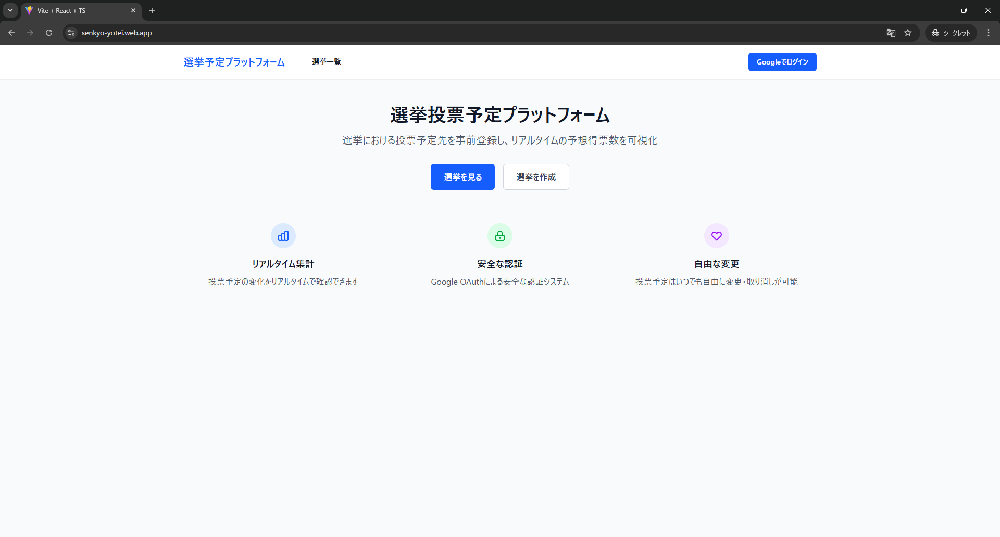
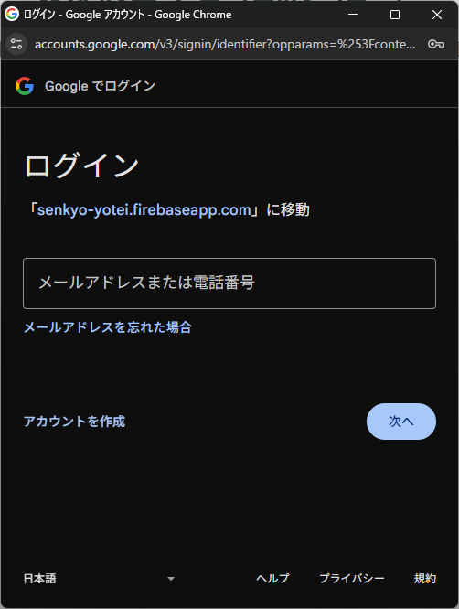
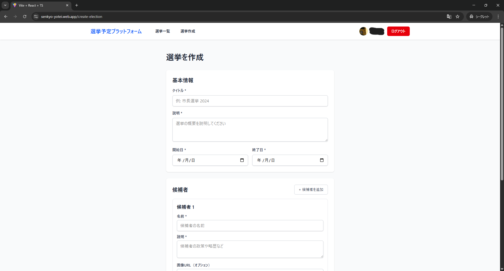
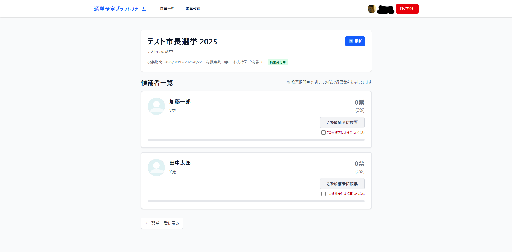
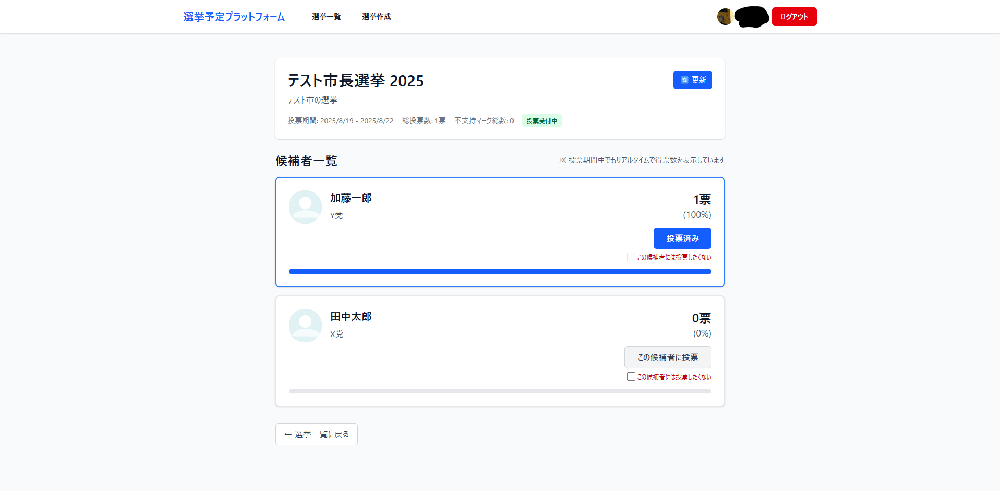
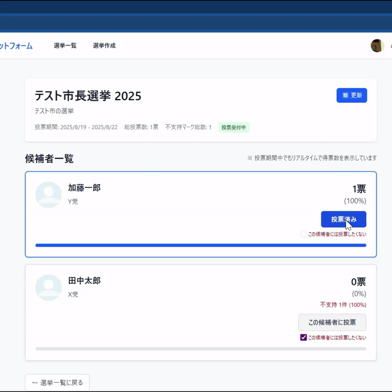
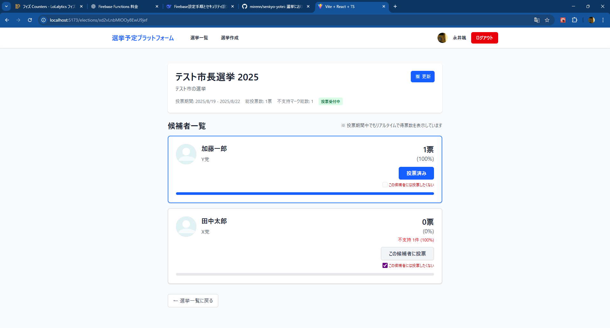

# 選挙 投票予定登録 / 予測プラットフォーム

市民が「どの候補へ投票する予定か」を事前登録し、集計結果をリアルタイムに可視化するプロジェクトです。早期に“空気”を数値化し、健全な議論促進を目指します。

重要: 投票はユーザー認証下で 1 人 1 票として厳格に管理しますが、一般公開される集計から個々のユーザーが「誰に投票したか / 不支持を付けたか」が特定されることはありません。ユーザー ID と投票予定の関連は内部整合性 (重複防止・改ざん検出) のみに使用し、公開ビューは集計値のみを提供します。

## 目次
1. コンセプト / ゴール
2. 主な機能 (ユーザー視点)
3. プライバシーと設計思想
4. 詳細設計 / 開発ガイドへの導線
5. UI ギャラリー
6. 今後のロードマップ / 拡張案
7. ライセンス / コントリビューション

---

## 1. コンセプト / ゴール
従来の選挙は「投票箱が開くまで分からない」構造でした。本サービスは“投票予定”をユーザー認証下で一意管理し、重複/改ざん防止を行いながら【公開側は統計的集計のみ】を提示します。これにより透明性と早期議論活性化を両立しつつ、個人の選好秘匿性を保持します。

## 2. 主な機能 (ユーザー視点)
- 選挙一覧・詳細閲覧 (未ログインでも可能)
- Google アカウントでログイン (Firebase Auth / OAuth)
- 選挙の新規作成（ログインユーザー）
- 候補者の複数登録
- 投票予定の登録 / 変更 / 取り消し (常に 1 票 / 1 選挙)
- 「この候補には投票したくない」不支持マーク機能（実装済）
   - 本機能は本プロジェクトの白眉。従来の公開選挙結果では見えにくかった「強い拒否感」の分布を可視化し、単純得票率だけでは読み取れない構造的支持/不支持のギャップを早期に把握できると考えています。
- リアルタイム更新（Firestore リスナー）
 - 公開インスタンス: https://senkyo-yotei.web.app/

## 3. プライバシーと設計思想
公開されるのは「候補ごとの集計値 (得票数 / 得票率 / 不支持数 / 不支持率 など)」のみです。個別ユーザーの選択は第三者から逆引きできません。内部的には 1 人 1 票制御と整合性検証のためユーザー単位レコードを保持します。実装上のデータモデル・セキュリティルール・集計ロジックの詳細は `architecture.md` をご覧ください。

## 4. 詳細設計 / 開発ガイドへの導線
技術スタック / データモデル / セキュリティルール / 集計アルゴリズム / 不支持マーク実装上の排他制御 などの詳細は `architecture.md` に集約しました。本 README では利用者・評価者向けの概要を中心に記載しています。

## 5. UI ギャラリー
利用イメージを把握するためのスクリーンショット集です。画像は `frontend/public/images/` 配下。

### スクリーンショット (サムネイル)

| 画面 | 画像 | 備考 |
|------|------|------|
| ホーム (一覧) |  | 未ログイン例 |
| ログインダイアログ |  | ポップアップ表示 |
| 選挙作成フォーム |  | バリデーション例歓迎 |
| 選挙詳細 |  | 投票前状態例 |
| 投票完了 |  | 選択済候補ハイライト |
| リアルタイム更新 |  | Firestore リスナー動作 (GIF) |
| 不支持マーク |  | 不支持 UI 実装例 |

## 6. 今後のロードマップ (必須コアのみ)
- 選挙ごとのコメント機能（候補や全体への意見共有。スパム/誹謗中傷対策としてレート制限・通報フラグ・後日モデレーション導線を設計）
- 選挙の編集・管理機能（現在は、選挙を作成したら編集も削除もできない。管理者権限による全選挙の編集・無効化機能追加。なお、削除ではなく選挙ステータス制御による非表示化で履歴保全を重視）
- 集計 Cloud Function のトランザクション / 冪等性強化（重複更新・競合時の整合性確保）
- App Check 導入 + レートリミット（Bot / Abuse 防止と無料枠保護）
- 監査ログコレクション (`/auditLogs`) による主要操作（選挙作成 / 投票 / 不支持 / コメント）の履歴保全
- 選挙ステータス (予定 / 進行中 / 終了) の自動更新（開始/終了日時に基づく UI 切替と投票受付制御）

## 7. ライセンス
本プロジェクトは Apache License 2.0 の下で提供されます。`LICENSE` ファイルを参照してください。
メモ：変更するかもしれません。

---
ご不明点・改善提案は Issue へお気軽にどうぞ。

---
Copyright (c) 2025

